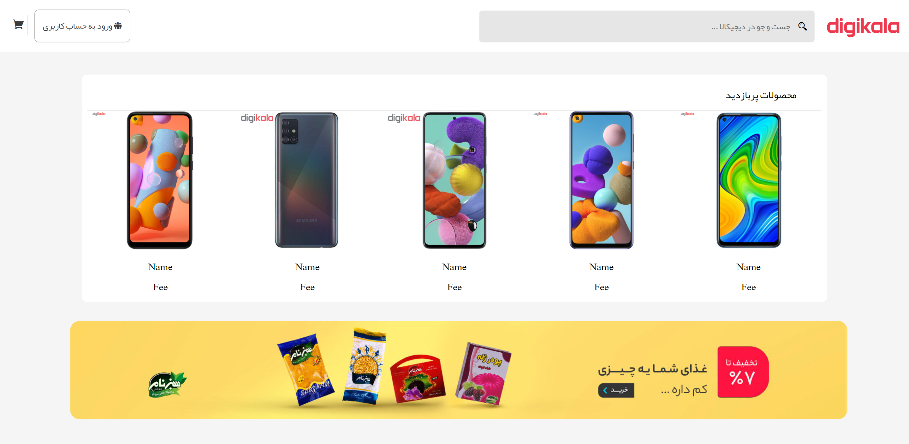
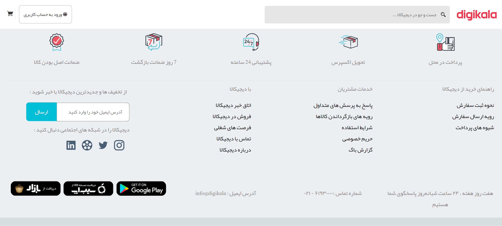

# DigikalaSample
Simple web-site templates based on "Digikala" web page.

# Introduction
A static website build from the famous website "digikala.com".

Used only HTML and CSS.

  

  
  

# Methods
To form the page I used bootstrap grid made by mysefl. Its a usefull way to manage the components and elements
in a webpage.

Also used the "Yekan" font, imported by fontface order.

Contact me at : najafizadeh21@gmail.com or officialamirhossein21@gmail.com
